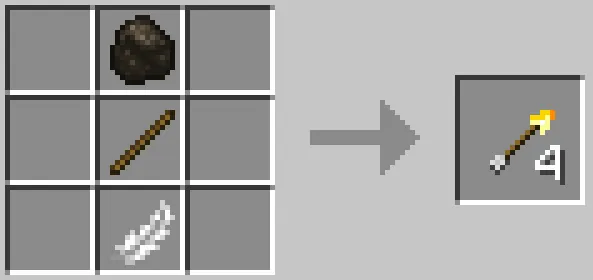
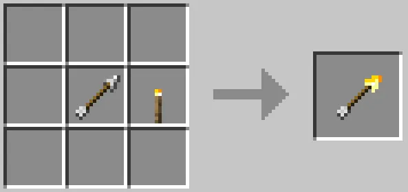

<p align="center"></p>

<h1 align="center">Light Me Up<br><br>
    <a href="https://fabricmc.net/">
        </a>
</h1>

### Light Me Up mod adds a Torch Arrow, allowing players to light up large areas faster.

Are you tired of climbing and running around caves, trying to place torches, all the while you try not get eaten by zombies or get blown up by creepers?

Then this mod is for you!

A torch arrow places a torch where it hits, if that location is valid for torch placement. This greatly speeds up and simplifies the lighting of large caverns and caves.

## Recipes

| Ingredients | Type | Recipe |
| --- | --- | --- |
| Coal, Stick, Feather | Shaped |  |
| Charcoal, Stick, Feather | Shaped |  |
| Arrow, Torch | Shapeless |  |

## Compatible with versions:

 - 1.20.1
 - 1.20.2

## Project Structure

- SDK: temurin-17
- Language level: 17

## Build

```
$ ./gradlew build
```

Output location: `./build/libs/light-me-up-1.0.0+1.20.1-2.jar`